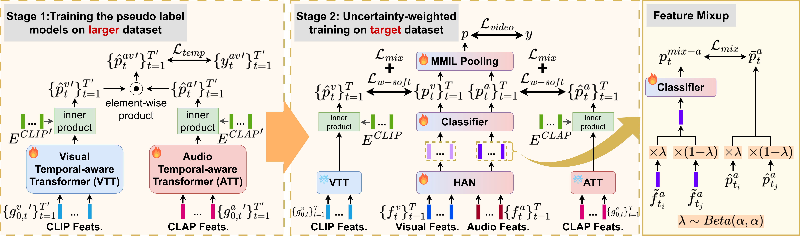

# UWAV: Uncertainty-weighted Weakly-supervised Audio-Visual Video Parsing

This is the official repository of CVPR 2025 paper [UWAV](https://arxiv.org/abs/2505.09615).  



[**UWAV: Uncertainty-weighted Weakly-supervised Audio-Visual Video Parsing**](https://arxiv.org/abs/2505.09615)
<br/>[Yung-Hsuan Lai](https://franklin905.github.io/), [Janek Ebbers](https://scholar.google.com/citations?hl=en&user=GSxZgjgAAAAJ&view_op=list_works&sortby=pubdate), [Yu-Chiang Frank Wang](https://vllab.ee.ntu.edu.tw/ycwang.html), [François Germain](https://scholar.google.com/citations?user=IM_ioMYAAAAJ&hl=en), [Michael Jeffrey Jones](https://scholar.google.com/citations?hl=zh-TW&user=h-V4QaMAAAAJ&view_op=list_works&sortby=pubdate), [Moitreya Chatterjee](https://sites.google.com/site/metrosmiles/home)<br/>


## Machine environment
- Ubuntu version: 20.04.6 LTS
- CUDA version: 12.4
- GPU: NVIDIA GeForce RTX 3090


## Requirements
A [conda](https://conda.io/) environment named `uwav` can be created and activated with:

```bash
conda env create -f environment.yaml
conda activate uwav
```


## Dataset setup

### UnAV dataset
#### Annotation files
Please download the annotation file `unav100_annotations.json` from [UnAV](https://drive.google.com/drive/folders/1X4eoCPPtqi0_IKd2JGOv_q383xd27Ybb) and place it in `data/UnAV/`.

#### Official pre-extracted features
Please download the official audio and visual features from [UnAV](https://drive.google.com/drive/folders/1xcNnXLVfd7cJEoGUvJYHerCXQnKFoPS-) and place them in `data/UnAV/feats/`.

#### CLAP- & CLIP-extracted features
Please download the CLAP-extracted features (`UnAV_CLAP.zip`) and CLIP-extracted features (`UnAV_CLIP.zip`) from [this link](https://huggingface.co/datasets/NTUBarista/uwav_features), unzip the two files, and place the decompressed CLAP-related files in `data/UnAV/feats_CLAP/` and the CLIP-related files in `data/UnAV/feats_CLIP/`.


### LLP dataset
#### Annotation files
Please download LLP dataset annotations (6 CSV files) from [AVVP-ECCV20](https://github.com/YapengTian/AVVP-ECCV20/tree/master/data) and place them in `data/LLP/`.

#### Official pre-extracted features
Please download the official audio features (VGGish), 2D visual features (ResNet152), and 3D visual features (ResNet (2+1)D) from [AVVP-ECCV20](https://github.com/YapengTian/AVVP-ECCV20) and place them in `data/LLP/feats/`.

#### CLAP- & CLIP-extracted features
Please download the CLAP-extracted features (`LLP_CLAP.zip`) and CLIP-extracted features (`LLP_CLIP.zip`) from [this link](https://huggingface.co/datasets/NTUBarista/uwav_features), unzip the two files, and place the decompressed CLAP-related files in `data/LLP/feats_CLAP/` and the CLIP-related files in `data/LLP/feats_CLIP/`.


### File structure for datasets
Please make sure that the file structure is the same as the following.

   <details><summary>File structure</summary>

   ```
   > data/
       ├── LLP/
       │    ├── AVVP_dataset_full.csv
       │    ├── AVVP_eval_audio.csv
       │    ├── AVVP_eval_visual.csv
       │    ├── AVVP_test_pd.csv
       │    ├── AVVP_train.csv
       │    ├── AVVP_val_pd.csv
       │    ├── feats/
       │    │     ├── r2plus1d_18/
       │    │     ├── res152/
       │    │     └── vggish/
       │    ├── feats_CLIP/
       │    │     ├── segment_feats/
       │    │     │     ├── -0A9sun15YA.npy
       │    │     │     ├── -0Bkyt8iZ1I.npy
       │    │     │     └── ...
       │    │     └── event_feats/
       │    │           └── all_event_feats.npy
       │    ├── feats_CLAP/
       │    │     ├── segment_feats/
       │    │     │     ├── -0A9sun15YA.npy
       │    │     │     ├── -0Bkyt8iZ1I.npy
       │    │     │     └── ...
       │    │     └── event_feats/
       │    │           └── all_event_feats.npy
       │    ├── visual_frames/ (optional)
       │    │     ├── 00BDwKBD5i8/
       │    │     ├── 00fs8Gpipss/
       │    │     └── ...
       │    └── raw_videos/ (optional)
       │          ├── 00BDwKBD5i8.mp4
       │          ├── 00fs8Gpipss.mp4
       │          └── ...
       └── UnAV/
            ├── unav100_annotations.json
            ├── feats/
            │     └── audio_features_vggish/
            │     └── visual_features_i3d_rgb/
            │     └── visual_features_i3d_flow/
            ├── feats_CLIP/
            │     ├── segment_feats/
            │     │     ├── -0DIFwkUpjQ.npy
            │     │     ├── -0KgYgXKFXs.npy
            │     │     └── ...
            │     └── event_feats/
            │           └── all_event_feats.npy
            └── feats_CLAP/
                  ├── segment_feats/
                  │     ├── -0DIFwkUpjQ.npy
                  │     ├── -0KgYgXKFXs.npy
                  │     └── ...
                  └── event_feats/
                        └── all_event_feats.npy
   ```

   </details>


## Training
1. Pre-train the temporal-aware transformers on the UnAV dataset
```bash
bash ./scripts/train_transformer.sh
```

2. Generate logits and calculate thresholds with the pre-trained transformers on the LLP dataset  
Please change the path of ```PRETRAINED_TRANSFORMER_DIR``` in the following file to the training log directory of the pre-trained transformers.
```bash
bash ./scripts/pseudo_label_generation.sh
```

3. Train the HAN model on the LLP dataset  
Please change the path of ```PRETRAINED_TRANSFORMER_DIR``` in the following file to where the pre-trained transformers training logs are.
```bash
bash ./scripts/train_han.sh
```

## Evaluation
Evaluate the trained HAN model on the LLP dataset  
Please change the path of ```CHECKPOINT_DIR``` in the following file to where the trained HAN model is saved.  

```bash
bash ./scripts/test_han.sh
```

## Acknowledgement
We build UWAV codebase heavily on the codebase of [AVVP-ECCV20](https://github.com/YapengTian/AVVP-ECCV20), [MM-Pyramid](https://github.com/JustinYuu/MM_Pyramid), and [UnAV](https://github.com/ttgeng233/UnAV). We sincerely thank the authors for open-sourcing! We also thank [CLIP](https://github.com/openai/CLIP) and [CLAP](https://github.com/LAION-AI/CLAP) for open-sourcing pre-trained models.


## Citation
If you find this code useful for your research, please consider citing:
```bibtex
@inproceedings{lai2025uwav,
  title={UWAV: Uncertainty-weighted Weakly-supervised Audio-Visual Video Parsing},
  author={Yung-Hsuan Lai, Janek Ebbers, Yu-Chiang Frank Wang, François Germain, Michael Jeffrey Jones, Moitreya Chatterjee},
  booktitle={CVPR},
  year={2025}
}
```


## License
This project is released under the MIT License.